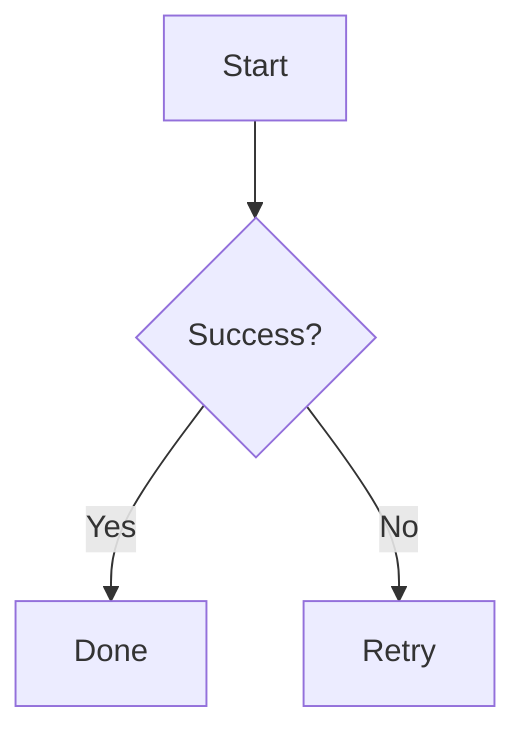

# dsh-mermaid-image-preview

A DeepSeek Harness Plugin for Previewing Mermaid Diagram Images

Render mermaid diagram images directly in DSH Web chat when the message
content contains mermaid syntax (a ` ```mermaid ` or ` ```mmd ` fenced code
block).


## Features and how it works

- **Local renderer first!**
- Setting card: you can adjust runtime settings in the UI - no restart needed.
- Mount point: `conversation.chat.turnTail` (chain slot, additive - never
  shadows shipped UI).
- Thumbnail display: the diagram renders as a thumbnail; click to enlarge in place, click again to shrink back (same element toggles, no popup).
- Light/dark themes follow the UI automatically.

The plugin renders diagrams locally with a built-in renderer. It supports
14 diagram types out of the box.

## Support diagram types

**Rendered locally:** flowchart, sequenceDiagram, classDiagram, stateDiagram, erDiagram, pie, journey, gitGraph, requirementDiagram, timeline, quadrantChart, packet-beta, xychart-beta

**Fallback (optional):** gantt, mindmap, block-beta, sankey-beta, architecture-beta, zenuml, C4Context

> [!NOTE]
> You can enable the fallback — see **Configuration** below.

## Installation

### Installation from `github`

```bash
### latest release version
$ npx @deepseek-ai/dsh plugin --profile web add github:baconbao/dsh-mermaid-image-preview#latest

### specific version
$ npx @deepseek-ai/dsh plugin --profile web add github:baconbao/dsh-mermaid-image-preview#<VERSION_TAG|GIT_TAG>

### dev version
$ npx @deepseek-ai/dsh plugin --profile web add github:baconbao/dsh-mermaid-image-preview#dev
```

### Installation from source code

```bash
$ git clone https://github.com/baconbao/dsh-mermaid-image-preview
$ cd dsh-mermaid-image-preview
$ pnpm install
$ dsh plugin --profile web add .
```

> [!IMPORTANT]
> Restart dsh web after installing.

## Configuration

### Change runtime settings on setting card


The **Plugins** settings page (**Settings > Plugins**) shows a `Mermaid image preview` card where
you can adjust plugin's runtime settings directly - no restart needed.
Values are stored in localStorage and applied immediately across all sessions.

### Change render server by profile patch

Diagrams are rendered locally by default. To use your own render server or
enable the external fallback, edit the profile's `cordis.patch.yml` (e.g.
`~/.dsh/profiles/web/cordis.patch.yml`):

```yaml
- id: ui-dsh-mermaid-image-preview
  config:
    enableLocalRender: true
    fallbackRenderUrl: https://mermaid.ink
    enableFallback: false
```

- `enableLocalRender`: render locally (default `true`). Set `false` to always use the fallback server (`enableFallback` is ignored).
- `fallbackRenderUrl`: fallback render server (default `https://mermaid.ink`).
- `enableFallback`: use the fallback server when local rendering fails (default `false`).
- Restart dsh web after changing these settings.
- To host your own fallback render server, we recommand to see <https://github.com/jihchi/mermaid.ink> for the details.

## Uninstallation

```bash
$ dsh plugin --profile web remove @baconbao/dsh-mermaid-image-preview
```

> [!NOTE]
> Since **v0.2.0** the plugin/package id is changed from `dsh-mermaid-image-preview` to `@baconbao/dsh-mermaid-image-preview`.

## Test

Ask the agent to produce:

````

````

---

## Author

baconbao, vibe coding with deepseek ai

## License

[MIT](./LICENSE)
