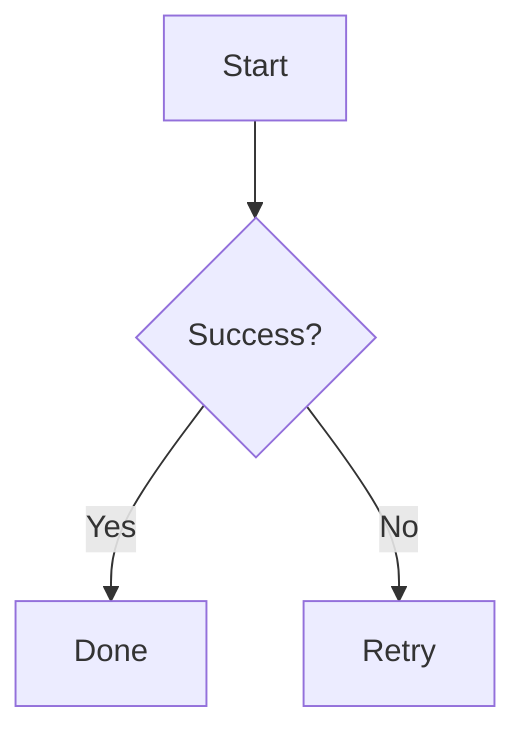

# dsh-mermaid-preview-plugin

A DeepSeek Harness Plugin for Previewing Mermaid Diagrams

Renders mermaid diagrams directly under the assistant message when the message
content contains mermaid syntax (a ` ```mermaid ` or ` ```mmd ` fenced code
block).

## How it works

- Mount point: `conversation.chat.turnTail` (chain slot, additive - never
  shadows shipped UI)
- Thumbnail display: the diagram renders as a thumbnail (max height
  configurable, default 204px); click to enlarge in place, click again to
  shrink back (same element toggles, no popup)
- Rendering: the browser builds a URL-safe base64 from the diagram source
  (UTF-8 safe via native `btoa` + `TextEncoder`) and loads
  `<mermaidInkUrl>/svg/<b64>[?theme=dark]` directly; light/dark themes follow the UI
- Configurable render server and thumbnail size: set `mermaidInkUrl` /
  `thumbMaxHeight` via the profile patch config (defaults to
  `https://mermaid.ink` / `204`)
- On failure, falls back to showing the raw source code block

This plugin uses [mermaid.ink](https://mermaid.ink) to generate the diagram
images directly: the browser builds a URL-safe base64 of the mermaid source
and requests `<mermaidInkUrl>/svg/<b64>[?theme=dark]`, which returns an SVG. 
See <https://mermaid.ink> for the service details.

## Configuration

### Replace the mermaid.ink render server and thumbnail size

To use your own mermaid-compatible render server or adjust the thumbnail
height, edit the profile's `cordis.patch.yml` (e.g.
`~/.dsh/profiles/web/cordis.patch.yml`):

```yaml
- id: ui-dsh-mermaid-preview-plugin
  config:
    mermaidInkUrl: https://your-own-mermaid-ink-server.example.com
    thumbMaxHeight: 204
```

- When unset, `mermaidInkUrl: https://mermaid.ink` / `thumbMaxHeight: 204px` are used (defaults)
- `mermaidInkUrl`: your local mermaid-ink server.
- `thumbMaxHeight`: positive integer, max thumbnail height in px.
- Restart dsh web after changing the settings

## Installation

```bash
$ git clone https://github.com/baconbao/dsh-mermaid-preview-plugin
$ cd dsh-mermaid-preview-plugin
$ pnpm install
$ cd ..
$ dsh plugin --profile web add dsh-mermaid-preview-plugin
```

## Removal

```bash
$ dsh plugin --profile web remove dsh-mermaid-preview-plugin
```

## Test

Ask the agent to produce:

````

````

---

## Author

baconbao, vibe coding with deepseek ai

# License

MIT