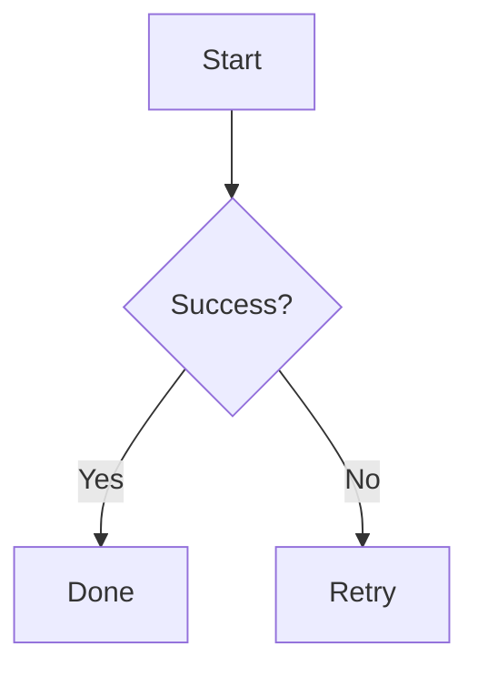

# dsh-mermaid-image-preview

A DeepSeek Harness Plugin for Previewing Mermaid Diagram Images

Renders mermaid diagram images directly under the assistant message when the message
content contains mermaid syntax (a ` ```mermaid ` or ` ```mmd ` fenced code
block).


## How it works

- Mount point: `conversation.chat.turnTail` (chain slot, additive - never
  shadows shipped UI)
- Thumbnail display: the diagram renders as a thumbnail (max height
  configurable, default 204px); click to enlarge in place, click again to
  shrink back (same element toggles, no popup)
- Rendering: the browser builds a URL-safe base64 from the diagram source
  (UTF-8 safe via native `btoa` + `TextEncoder`) and loads
  `<mermaidInkUrl>/svg/<b64>[?theme=dark]` directly; light/dark themes follow the UI
- Enable/Disable switch: persisted in localStorage, survives restarts

This plugin uses Mermaid.ink to generate the diagram
images directly: the browser builds a URL-safe base64 of the mermaid source
and requests `<mermaidInkUrl>/svg/<b64>[?theme=dark]`, which returns an SVG. 
See <https://github.com/jihchi/mermaid.ink> for the details.

## Installation

### Installation from `github`

```bash
### latest release version
$ npx @deepseek-ai/dsh plugin --profile web add github:baconbao/dsh-mermaid-image-preview#latest

### specific version
$ npx @deepseek-ai/dsh plugin --profile web add github:baconbao/dsh-mermaid-image-preview#<VERSION_TAG|GIT_TAG>

### dev version
$ npx @deepseek-ai/dsh plugin --profile web add github:baconbao/dsh-mermaid-image-preview#dev
```

### Installation form source code

```bash
$ git clone https://github.com/baconbao/dsh-mermaid-image-preview
$ cd dsh-mermaid-image-preview
$ pnpm install
$ cd ..
$ dsh plugin --profile web add dsh-mermaid-image-preview
```

## Configuration

### Configurate the mermaid.ink render server and thumbnail size

To use your own mermaid-compatible render server or adjust the thumbnail
height, edit the profile's `cordis.patch.yml` (e.g.
`~/.dsh/profiles/web/cordis.patch.yml`):

```yaml
- id: ui-dsh-mermaid-image-preview
  config:
    mermaidInkUrl: https://your-own-mermaid-ink-server.example.com
    thumbMaxHeight: 204
```

- `mermaidInkUrl`: your local mermaid-ink server.
- `thumbMaxHeight`: positive integer, max thumbnail height in px.
- When unset, `mermaidInkUrl: https://mermaid.ink` and `thumbMaxHeight: 204px`
  are used as defaults.
- Restart dsh web after changing the settings.

## Removal

```bash
$ dsh plugin --profile web remove dsh-mermaid-image-preview
```

## Test

Ask the agent to produce:

````

````

---

## Author

baconbao, vibe coding with deepseek ai

## License

[MIT](./LICENSE)
